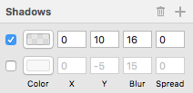
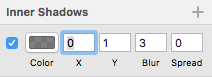

# All about Box-Shadow

Okay, you designed a nice looking drop shadow. Now do I save this as an image file? Is this design possible in CSS? Yes! Oh YES!

## The box-shadow

Drop shadow effect can be represented with the box-shadow property in CSS.

**Syntax:**
```css
.dropShadow {
  box-shadow: [horizontal offset] [vertical offset] 
  [blur radius] [optional spread radius] [color];
}
```
Hmm... I've seen this somewhere :) 



I've been doing this everyday! The design says:  <br />
  1. The horizontal offset is 0.
  2. The vertical offset is 10px.
  3. The blur radius is set to 16px.
  4. There's no spread radius.
  5. The shadow color is #000 (black) with an opacity set to 10%.

If you code this description it will be like this:

```css
.dropShadow {
  box-shadow: 0 10px 16px rgba(0,0,0,0.1);
}
```

*Note:*
* For mozilla browsers, use `-moz-box-shadow`
* For webkit browsers, use `-webkit-box-shadow`


## The Inner Shadow



There's also an inner shadows panel in Sketch. How to turn this in code? Let's find out.

```css
.innerShadow {
box-shadow: inset 0 1px 3px rgba(0,0,0,0.5);
}
```

You just add inset in front and that's it!


