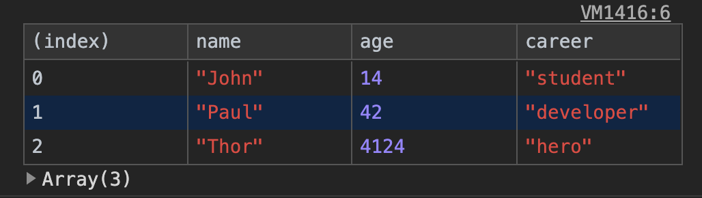
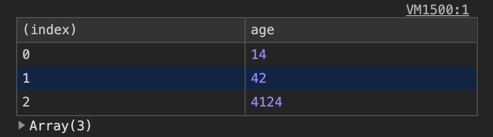

# Console

Helpful console methods

__HTML document__

```HTML
<body>
  <h1 class="title">Hello World</h1>
  <p>Some Text</p>
</body>
```

## `console.dir`

```JS
  const element = document.querySelector(.title)
  console.log(element); // html
  console.dir(element); // properties
```

## `console.table`

Display array and object as a table.

```JS
  const data = [
    { name: 'John', age: 14, career: 'student' },
    { name: 'Paul', age: 42, career: 'developer' },
    { name: 'Thor', age: 4124, career: 'hero' },
  ];

  console.table(data); // shows all elements and properties of data array
  console.table(data, 'age'); // filter age property and show in column
```

`console.table(data)`
>

`console.table(data, 'age')`
>
