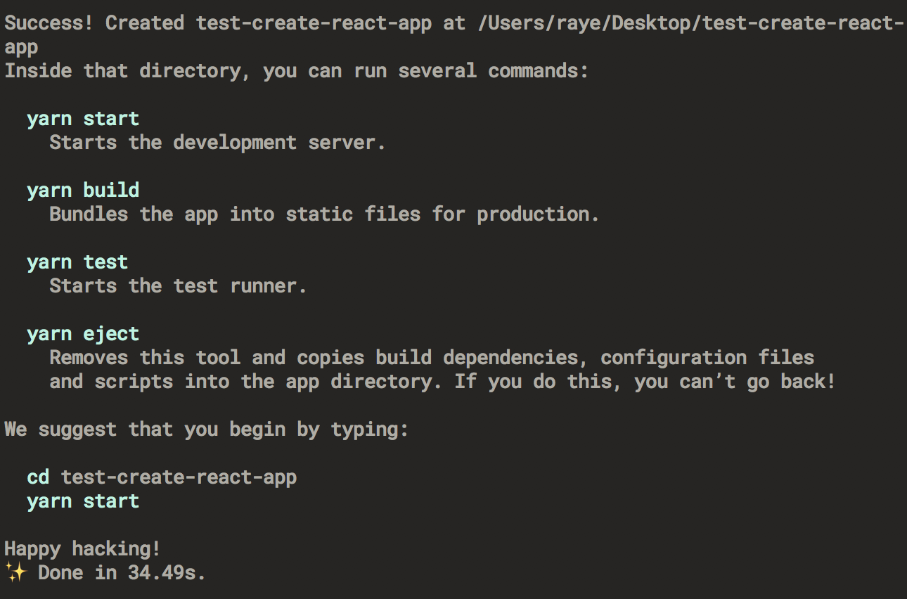
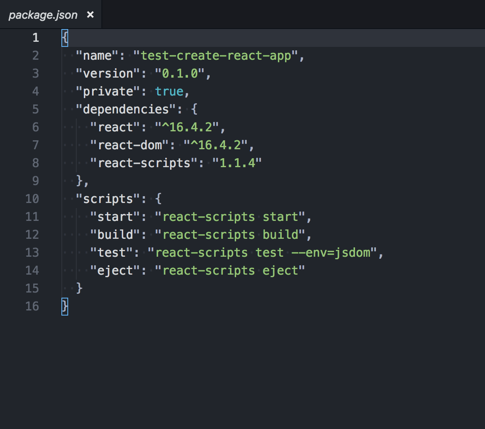
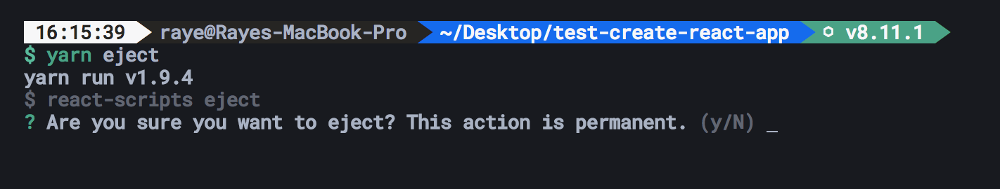
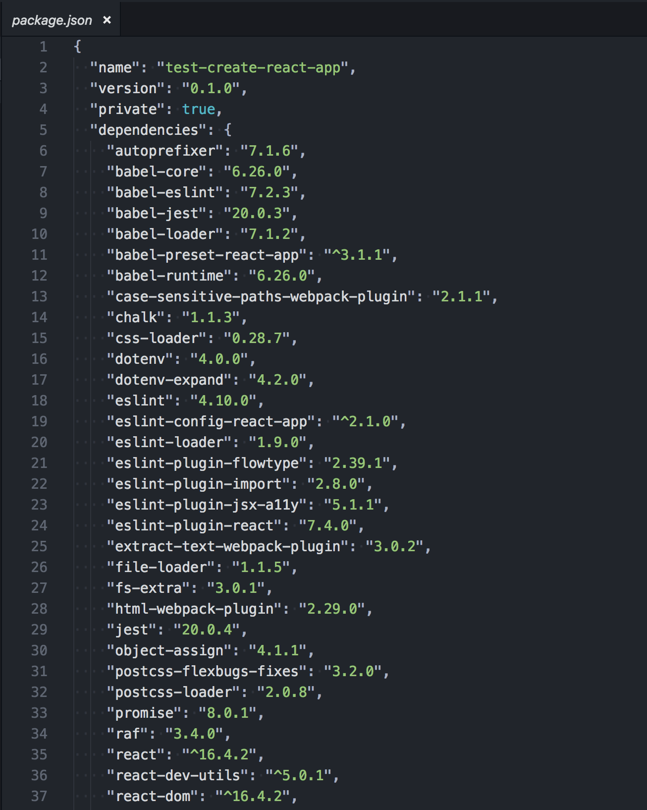

# Create-React-App Fancy Webpack for React

`create-react-app` gets you to start a react project in no time. No configuration needed!

## To Use

To start using __'create-react-app'__ in your terminal type under these conditions:

__Node version:__ 6 or higher\
__App name:__ my-app

__Using yarn:__\
__`yarn create react-app my-app`__

__Using npm:__\
__`npm init react-app my-app`__

After a while, your terminal will return a success message.

## To add custom dev-dependencies

The concept of __'create-react app'__ is to just get started without the need to configure your own __react environment__. Say you want to use sass in your project. Then you would need to add your own dev-dependencies. When you first create a react project using 'create-react-app' your package.json will look like this:

Hold on a minute... there should be babel-rc, babel-cli... but there's none! We'd have to make them appear :) for us to use create-react-app fully for our own preferences.

### In your terminal:

__Using yarn:__\
`yarn eject`

__Using npm:__\
`npm run eject`

Once you `eject` package.json, you won't be able to go back. That's why terminal will alert you with the following:

__Hit y__ and eject.\
If you see a whole bunch of lists appear in your package.json you've done an `eject` successfully :>

Now customize 'create-react-app' to your needs.